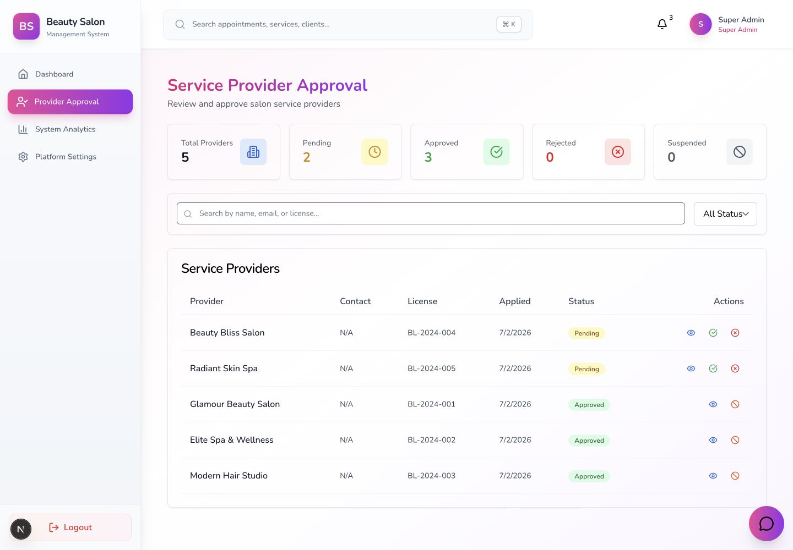
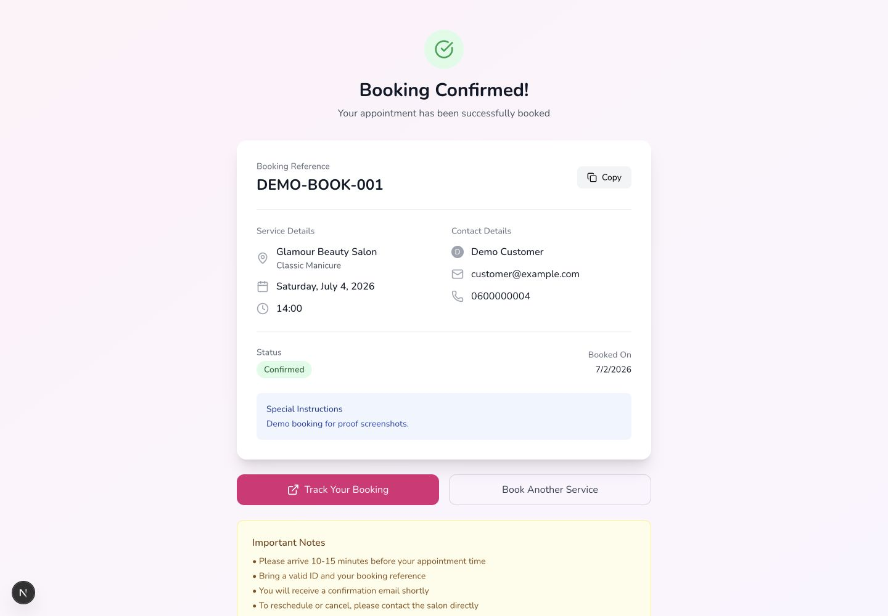
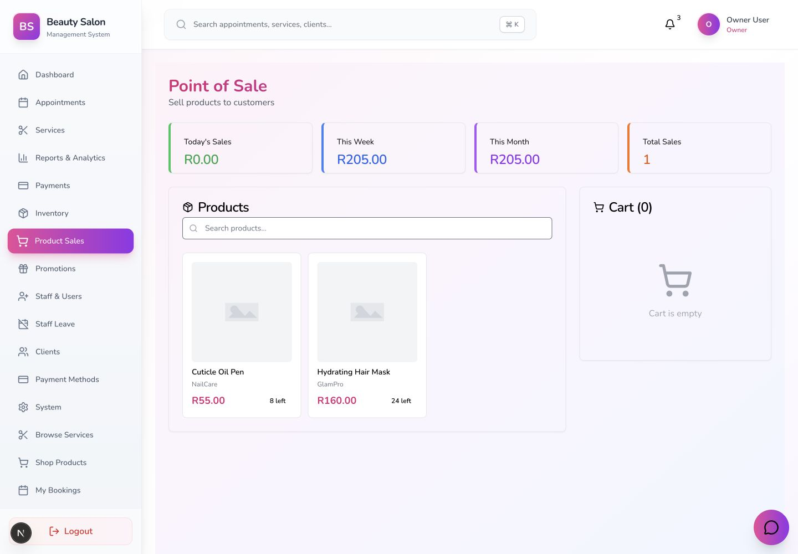
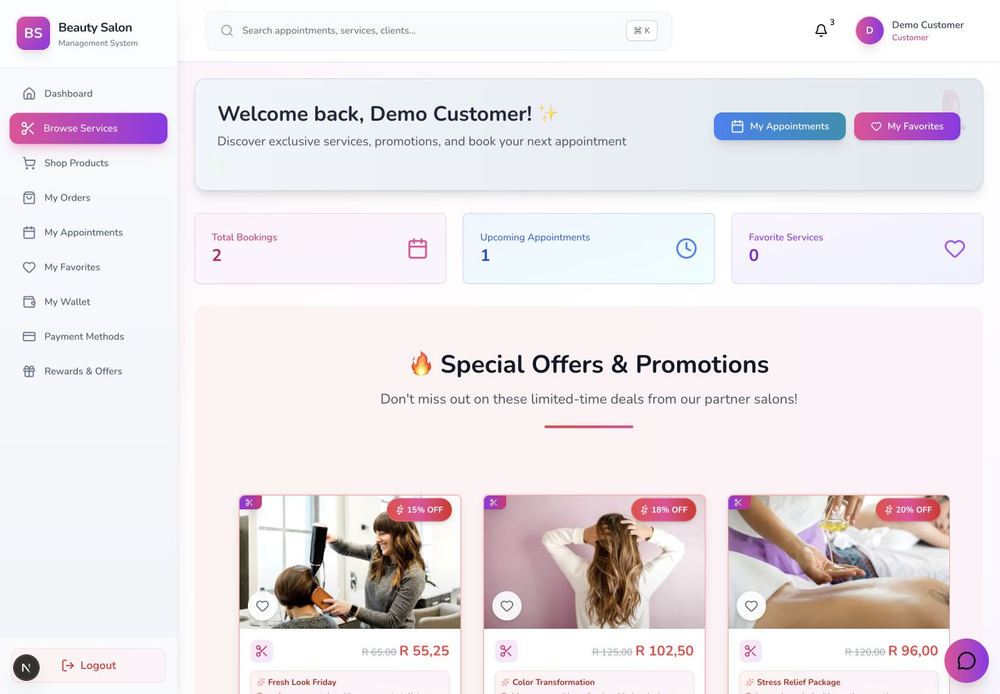
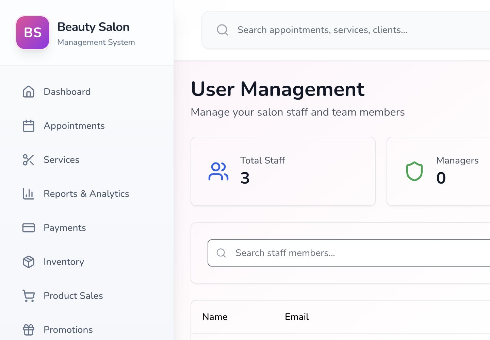
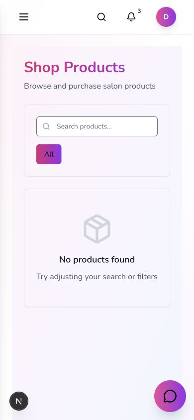

# Beauty Salon Management Frontend

Next.js frontend for a multi-tenant beauty salon management platform. The app supports customer booking flows, admin operations, staff schedules, super-admin provider management, payments, inventory, reports, rewards, and role-aware navigation.

This repository pairs with the Laravel API backend:

- Backend: `https://github.com/silindokuhleL/beauty-salon-management-backend-public`

## What This Project Shows

- Full-stack SaaS product thinking across customer, staff, admin, and platform-operator workflows.
- Tenant-aware salon operations with separate dashboards and protected user journeys.
- Payment-aware booking and product flows connected to the backend payment API.
- Role-aware UI and route protection for Admin, Owner, Manager, Staff, Receptionist, Customer, IT Support, and Super Admin users.
- A production-style frontend structure using reusable UI primitives, data fetching hooks, typed app routes, and dashboard pages.

## Visual Proof

### Super Admin Provider Approval

Platform owners can review provider applications, see approval counts, and manage provider state.



### Customer Booking Confirmation

Customers get a confirmed booking reference with salon, service, date, time, contact details, status, and instructions.



### Owner Product Sales / POS

Salon owners can sell tenant-scoped products, see sales totals, and manage cart state from the admin POS screen.



### Customer Services Marketplace

Customers can browse promotions and services from partner salons with responsive marketplace UI.



### Role-Aware User Management

Owner/admin users can manage staff and team members from protected admin screens.



### Mobile Customer Products

The customer product flow was checked at a 390px mobile viewport with no horizontal overflow.



## Main Features

- Public service browsing, guest booking, booking tracking, and payment callback pages.
- Customer dashboard with booking history, appointments, favorites, rewards, wallet, products, payment methods, and orders.
- Admin dashboard with appointments, services, clients, inventory, payment methods, payments, product sales, promotions, reports, reviews, staff leave, staff, system, and users.
- Staff dashboard with schedule, appointments, and leave workflows.
- Super-admin dashboard with analytics, provider approval, and platform settings.
- Shared notification center, sidebar navigation, role-based route protection, and reusable UI components.

## Tech Stack

- Next.js 16.2.10
- React 19.2.7
- TypeScript
- Tailwind CSS
- Axios
- SWR
- FullCalendar
- ECharts 6.1.0
- Radix UI primitives
- Lucide React
- React Hot Toast

## Local Setup

Install dependencies:

```bash
npm install
```

Create the environment file:

```bash
cp .env.example .env.local
```

Set the backend URL:

```bash
NEXT_PUBLIC_BACKEND_URL=http://localhost:8000
```

Run the development server:

```bash
npm run dev
```

The frontend usually runs at:

```text
http://localhost:3000
```

## Useful Scripts

```bash
npm run dev
npm run build
npm run start
npm run lint
npm run lint:fix
```

Current local proof status:

- `npm run lint` passes with no ESLint warnings or errors.
- `npm run build` passes and generates the full route set for public booking, payment callback, customer, staff, admin, and super-admin areas.
- `npm audit --omit=dev` reports 0 vulnerabilities after upgrading Next.js, React, ECharts, Headless UI, SWR, ESLint tooling, and overriding Next's nested PostCSS dependency to `8.5.16`.
- Local proof has been run against the Laravel API using `NEXT_PUBLIC_BACKEND_URL=http://127.0.0.1:8011`.
- Verified Browser screenshot proof covers Super Admin dashboard, Provider Approval, Owner dashboard, Payment Management, Product Sales, Staff Leave, User Management, Services Marketplace, Product Marketplace, Booking Confirmation, and mobile customer views.
- Browser testing verified Owner, Customer, and Super Admin demo logins and role-specific navigation.
- Native `` usage has been replaced with a reusable Next.js image wrapper for optimized service, product, appointment, avatar, and upload-preview images.

Demo login accounts used with the paired backend:

| Role | Email | Password |
| --- | --- | --- |
| Super Admin | `superadmin@platform.com` | `password123` |
| Owner | `owner@glamourbeautysalon.com` | `password123` |
| Staff | `staff@glamourbeautysalon.com` | `password123` |
| Customer | `customer@example.com` | `password123` |

## Key Frontend Areas

- `src/app/(auth)` - login, registration, password reset, and email verification routes.
- `src/app/(app)/admin` - admin and owner operations.
- `src/app/(app)/customer` - customer self-service workflows.
- `src/app/(app)/staff` - staff schedule and appointment workflows.
- `src/app/(app)/super-admin` - platform-level provider and analytics workflows.
- `src/components` - shared UI, layout, role-based route protection, and product components.
- `src/hooks` and `src/lib` - API integration, authentication, and app utilities.

## Backend Integration

The frontend expects the Laravel API to provide:

- Sanctum authentication.
- User, role, and permission data.
- Public service and booking endpoints.
- Payment initialization and callback endpoints.
- Customer wallet, rewards, product, and purchase endpoints.
- Admin endpoints for users, services, appointments, inventory, payments, reports, providers, staff leave, and tenant profile management.

## Project Documentation

Additional local documentation:

- `PROOF_CAPTURE_GUIDE.md`
- `SYSTEM_REQUIREMENTS.md`
- `TECHNICAL_DOCUMENTATION.md`
- `USER_INTERFACE_GUIDE.md`
- `TESTING_STRATEGY.md`
- `INSTALLATION_GUIDE.md`
- `USER_MANUAL.md`
- `PROJECT_REPORT.md`

## Portfolio Notes

This is one of the strongest portfolio projects because it shows a realistic SaaS product surface: payments, RBAC, multi-tenancy, booking operations, inventory, product sales, reporting, and role-specific dashboards.

Optional proof to add later:

- Safe Paystack callback/payment-initialization screenshot.
- Staff-facing appointment and leave-request screenshot.
- A short walkthrough video showing the full booking-to-payment flow.

See `PROOF_CAPTURE_GUIDE.md` for the exact route, account, viewport, and filename checklist.
